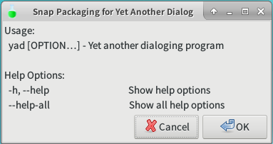

# Unofficial Snap Packaging for Yet Another Dialog
<!--
	Use the Staticaly service for easy access to in-repo pictures:
	https://www.staticaly.com/
-->

**This is the unofficial snap for Yet Another Dialog**, *"Program allows you to display GTK+ dialog boxes from command line or shell scripts"*. It works on Ubuntu, Fedora, Debian, and other major Linux distributions.

Published for  with 💝 by Snapcrafters

## Installation
([Don't have snapd installed?](https://snapcraft.io/docs/core/install))

### In Terminal
    # Install Snap #
    sudo snap install --channel=edge --devmode yad-brlin
    #sudo snap install --channel=beta yad-brlin
    #sudo snap install yad-brlin

    # Launch the Application #
    snap run yad-brlin.yad
    snap run yad-brlin.yad-icon-browser

### The Graphical Way

## What is Working
* `--text`
* `--title`

## What is NOT Working...yet 
* HTML support is disabled for now

Check out the [issue tracker](https://github.com/Lin-Buo-Ren/yad-snap/issues) for more known issues.

## What is NOT Tested...yet
Anything not listed in "What is Working" and "What is NOT Working...yet" sections.

## Support
* Report issues regarding using this snap to the issue tracker:  
  <https://github.com/Lin-Buo-Ren/yad-snap/issues>
* You may also post on the Snapcraft Forum, under the `snap` topic category:  
  <https://forum.snapcraft.io/c/snap>
